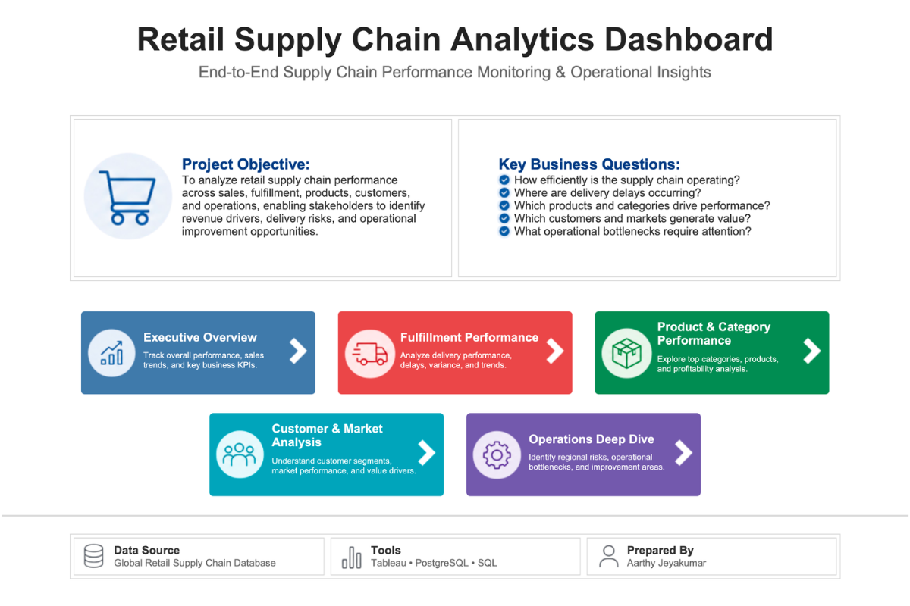
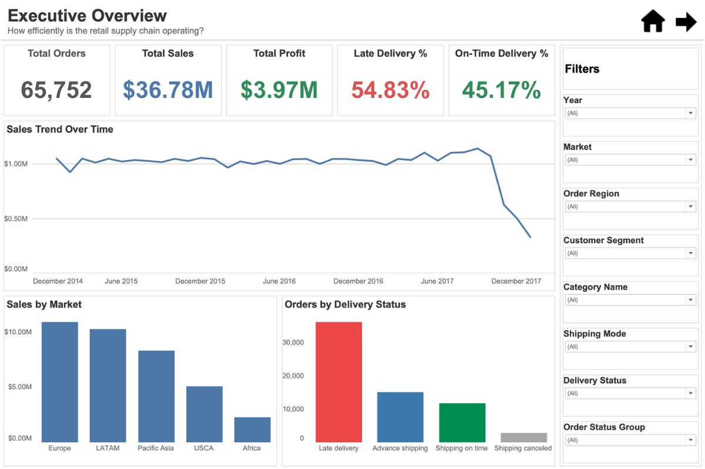
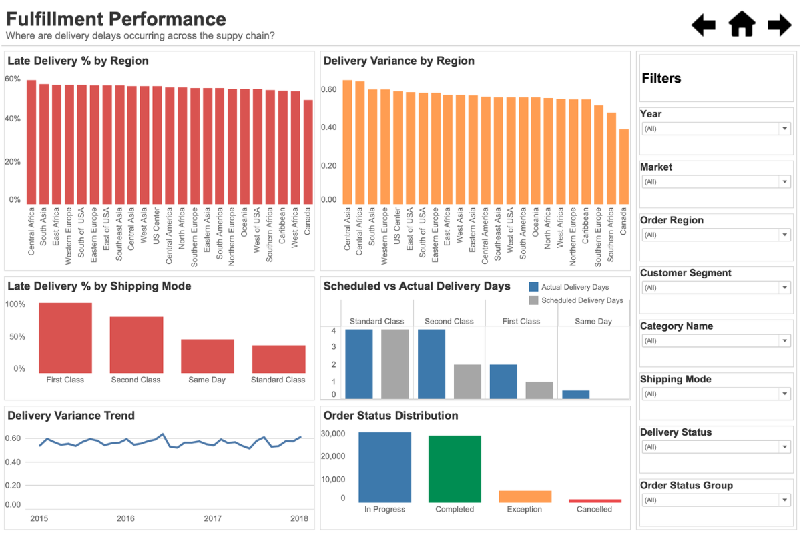
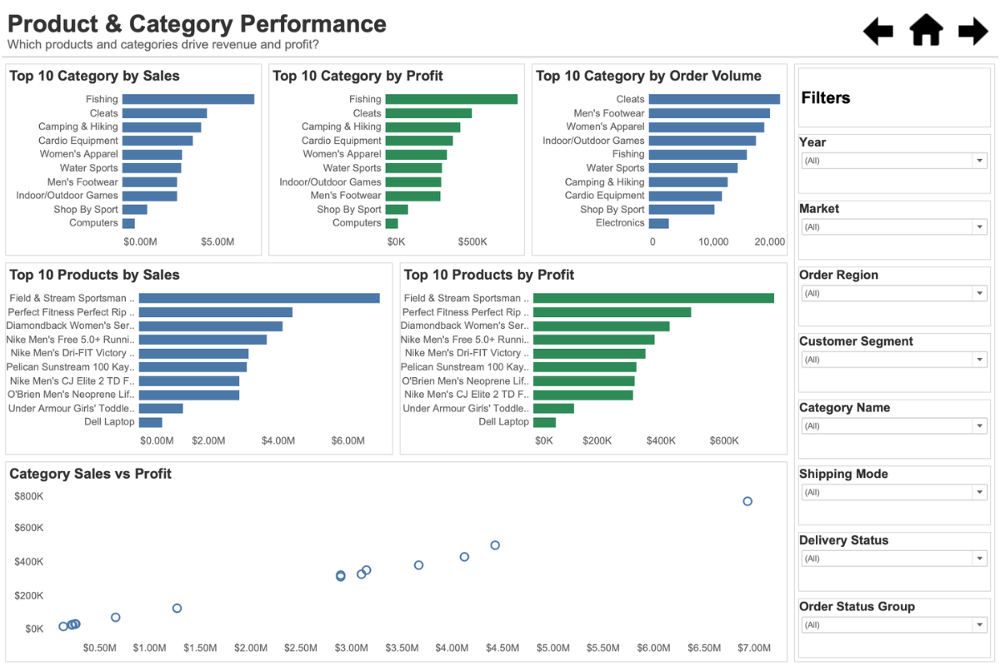
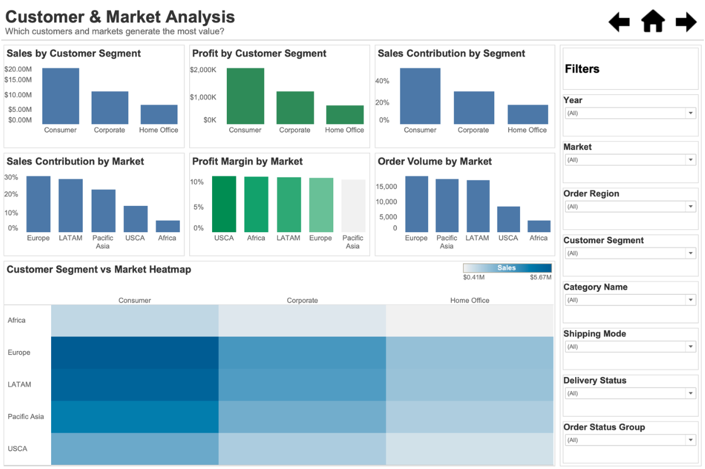
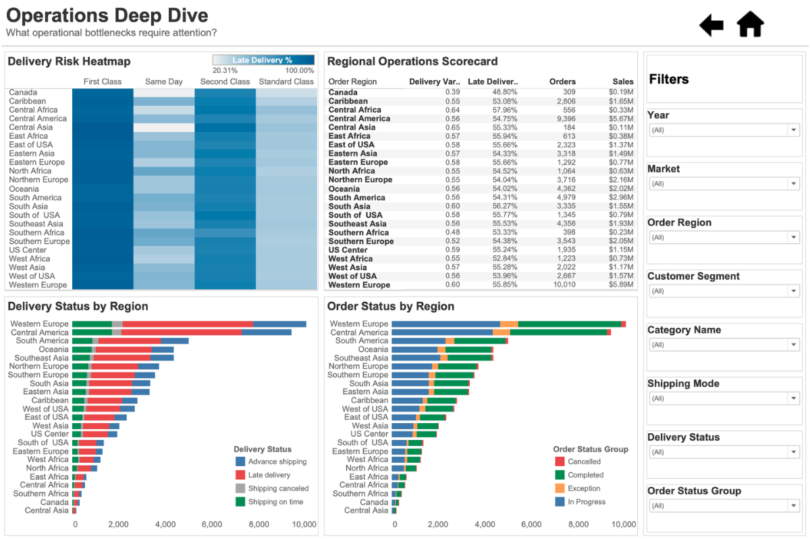

# Retail Supply Chain Analytics Dashboard

Interactive Tableau dashboard designed to analyze retail supply chain performance across sales, fulfillment, products, customers, markets, and operations. The project leverages PostgreSQL and SQL for data preparation and Tableau for interactive dashboard development.

## Project Overview

Retail supply chains generate large volumes of operational data across orders, deliveries, products, customers, and markets. Without centralized reporting, stakeholders often struggle to identify delivery risks, profitability drivers, customer value, and operational bottlenecks.

This project consolidates key supply chain metrics into an interactive Tableau dashboard that enables users to monitor business performance, evaluate fulfillment efficiency, analyze product profitability, understand customer and market behavior, and identify operational improvement opportunities.

## Business Problem

Supply chain stakeholders need visibility into order performance, delivery efficiency, product profitability, customer behavior, and operational risks. However, these insights are often distributed across multiple systems, making it difficult to identify performance gaps and make timely decisions.

## Solution

Developed a multi-page Tableau analytics application that integrates supply chain data into a centralized reporting environment. The dashboard enables users to:

* Monitor overall business performance through KPI scorecards and trend analysis
* Identify fulfillment delays and delivery risks across regions and shipping modes
* Evaluate product and category performance using sales, profit, and order volume metrics
* Analyze customer segments and market contribution
* Detect operational bottlenecks through regional performance monitoring and risk analysis

## Tools & Technologies

| Tool       | Purpose                                               |
| ---------- | ----------------------------------------------------- |
| PostgreSQL | Database creation, data storage, and analytical views |
| SQL        | Data preparation, transformation, and aggregation     |
| Tableau    | Interactive dashboard development and visualization   |

## Dataset

**Source:** Retail Supply Chain Dataset (Kaggle)

**Dataset Link:** [Dataset_Link](https://www.kaggle.com/datasets/saicharankomati/dataco-supply-chain-dataset)

The dataset was imported into PostgreSQL, transformed using SQL, and connected to Tableau for interactive dashboard development and analysis.

## Dashboard Demo

Interactive dashboard walkthrough demonstrating navigation, filtering, KPI analysis, and drill-down capabilities.

**Video:** [Dashboard_Demo.mp4](https://github.com/AarthyJ7/Retail-Supply-Chain-Analytics-Dashboard/blob/main/Dashboard_Demo.mp4)

## Dashboard Architecture

The analytics application consists of a homepage and five dedicated dashboards designed to answer key supply chain business questions.

### Home Page

Provides project context, business objectives, key questions, and navigation to individual dashboard modules.

### Executive Overview

Answers: **How efficiently is the retail supply chain operating?**

Key capabilities:

* KPI monitoring
* Sales and profit tracking
* Order volume analysis
* Delivery performance monitoring
* Sales trend analysis

### Fulfillment Performance

Answers: **Where are delivery delays occurring?**

Key capabilities:

* Regional delivery performance analysis
* Shipping mode evaluation
* Delivery variance monitoring
* Scheduled vs. actual delivery comparison
* Order status tracking

### Product & Category Performance

Answers: **Which products and categories drive performance?**

Key capabilities:

* Category performance analysis
* Product profitability evaluation
* Revenue contribution analysis
* Order volume assessment
* Sales versus profit analysis

### Customer & Market Analysis

Answers: **Which customers and markets generate the most value?**

Key capabilities:

* Customer segment evaluation
* Market contribution analysis
* Profitability assessment
* Customer-market relationship analysis
* Comparative performance monitoring

### Operations Deep Dive

Answers: **What operational bottlenecks require attention?**

Key capabilities:

* Regional operational monitoring
* Delivery risk assessment
* Operational scorecards
* Status distribution analysis
* Risk concentration identification

## Dashboard Preview

### Home Page

Project landing page providing business context, dashboard navigation, and key business questions.

---

### Executive Overview

High-level KPI monitoring dashboard focused on overall business performance, sales trends, and delivery metrics.

---

### Fulfillment Performance

Operational dashboard designed to identify delivery delays, fulfillment bottlenecks, and shipping performance issues.

---

### Product & Category Performance

Product analytics dashboard evaluating category performance, product profitability, and revenue contribution.

---

### Customer & Market Analysis

Customer and market intelligence dashboard highlighting value drivers, segment performance, and profitability.

---

### Operations Deep Dive

Operational monitoring dashboard focused on regional risk identification, status tracking, and performance management.

## Data Preparation & SQL

Data was imported into PostgreSQL and transformed using SQL before visualization in Tableau.

The repository includes:

* [database_setup.sql](database_setup.sql) – Database and table creation scripts
* [data_import.sql](data_import.sql) – Data loading and import processes
* [analytical_views.sql](analytical_views.sql) – Analytical views supporting dashboard reporting and KPI calculations

This approach separates data preparation, business logic, and visualization layers, mirroring common analytics workflows used in production environments.

## Tableau Workbook

[Retail_Supply_Chain_Dashboard.twbx](Retail_Supply_Chain_Fulfillment_Analytics_Dashboard.twbx)
